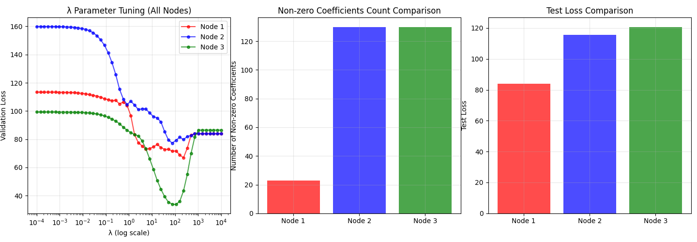
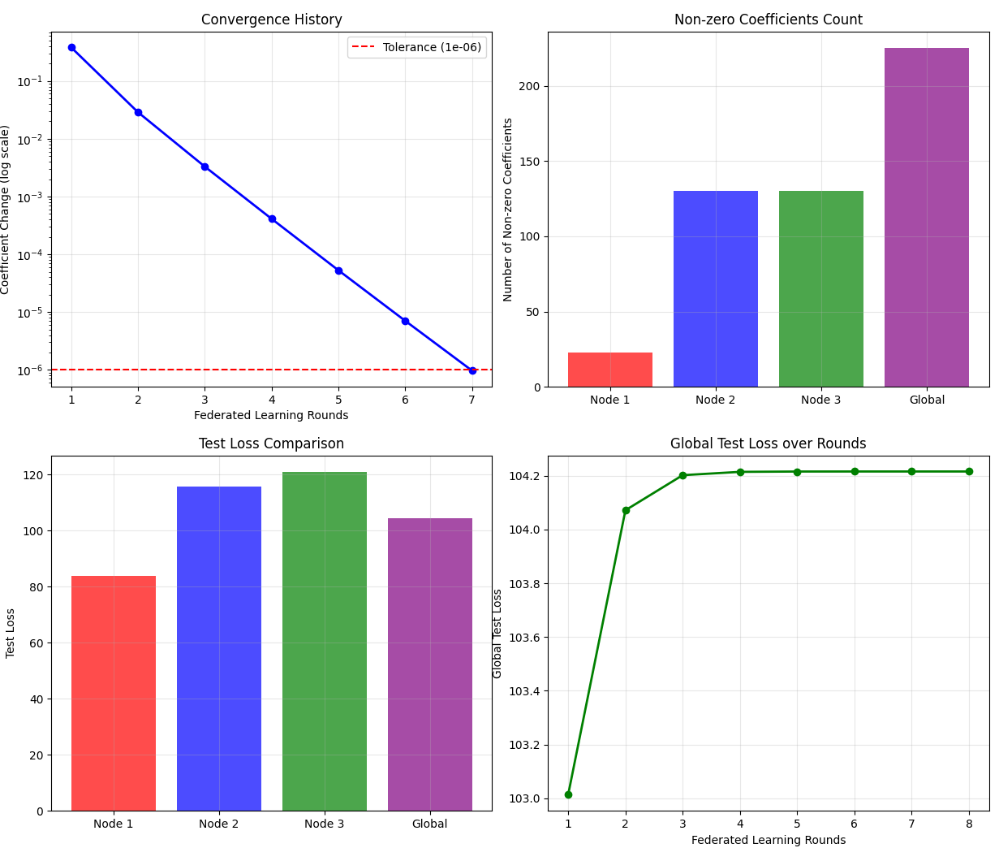
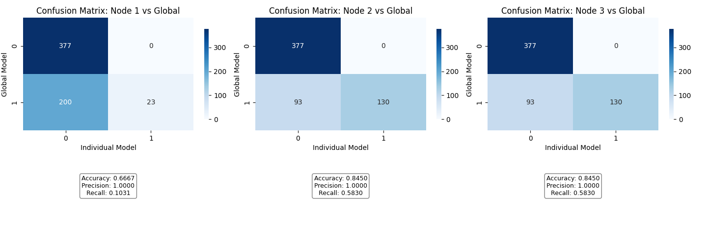

# Federated Lasso Regression via Coordinate Desent

[Chinese Version README(中文版)](README_CN.md)

## 1. Project Overview

This project provides a comprehensive implementation of Lasso Regression using the Coordinate Descent algorithm, built from the ground up in Python. It further extends this implementation to a federated learning (FL) environment, simulating a scenario where multiple data owners collaborate to train a powerful, unified model without sharing their private datasets.

* **Part A: Individual Model Training:** Implement Lasso regression, tune the regularization hyperparameter $\lambda$ for three separate datasets, and analyze the resulting models.
* **Part B: Federated Learning:** Construct a federated system where a central "Trusted Aggregator" coordinates model training across the data owners. This demonstrates a practical approach to privacy-preserving machine learning.

This repository is designed to be a professional showcase of algorithm implementation, experimental design, and analysis of modern machine learning paradigms.

### Key Features

* **Lasso from Scratch:** Clean implementation of the Lasso Coordinate Descent algorithm, including the soft-thresholding function.
* **Federated Learning Framework:** A robust simulation with a `TrustedAggregator` and multiple data nodes.
* **Hyperparameter Tuning:** A validation-set-based approach to find the optimal regularization parameter $\lambda$.
* **Detailed Analysis:** In-depth comparison of individual models vs. the global federated model.
* **Performance Evaluation:** Analysis of how communication frequency (local iterations) impacts convergence speed and final model performance in the FL setting.

## 2. Methodology

### A. Lasso via Coordinate Descent

Lasso regression adds an L1 penalty to the loss function, encouraging sparse coefficient vectors. The objective function is:

$$ \text{Loss} = \frac{1}{2n} \sum_{i=1}^{n} (y_i - (\beta_0 + \sum_{j=1}^{p} x_{ij}\beta_j))^2 + \lambda \sum_{j=1}^{p} |\beta_j| $$

Instead of using gradient-based methods, which can be inefficient with the non-differentiable L1 norm, we use **Coordinate Descent**. The algorithm iteratively optimizes one coefficient at a time, holding all others fixed. The update for the j-th coefficient $\beta_j$ is performed using a **soft-thresholding** operator:

$$ \beta_j \leftarrow S(z_j, \lambda) = \text{sign}(z_j) \max(|z_j| - \lambda, 0) $$

where $z_j = \frac{1}{n} \sum_{i=1}^{n} x_{ij}(y_i - \sum_{k \neq j} x_{ik}\beta_k)$.

### B. Federated Averaging

To train a model collaboratively without sharing data, we use a federated learning approach based on the Federated Averaging (FedAvg) algorithm:

1.  **Initialization:** The Trusted Aggregator initializes a global model (with zero-vector coefficients) and distributes it to all data owners.
2.  **Local Training:** Each data owner trains the received model on their local data for a fixed number of iterations (e.g., 5 or 10) using their own pre-tuned $\lambda_k$.
3.  **Aggregation:** Each owner sends their updated model coefficients back to the aggregator.
4.  **Global Model Update:** The aggregator computes a weighted average of the received coefficients, with weights proportional to the sample size of each data owner.
5.  **Iteration:** The process repeats until the global model's coefficients converge (change is less than a tolerance of $10^{-6}$).

## 3. Results & Analysis

### Part A: Individual Node Models

Each dataset was split into 80% training and 20% validation. The best regularization parameter $\lambda$ was selected based on the lowest validation loss.

| Node | Best $\lambda$ | Validation Loss | Test Loss | # Non-Zero Coeffs |
|:----:|:--------------:|:---------------:|:---------:|:-------------------:|
| 1    | 232.995        | 66.89           | 83.92     | 23                  |
| 2    | 75.431         | 77.29           | 115.74    | 130                 |
| 3    | 109.854        | 33.81           | 120.75    | 130                 |

**Intersection of Non-Zero Coefficients:** There are **13** coefficients that are non-zero across all three independently trained models: `[123, 249, 299, 305, 362, 399, 447, 461, 493, 500, 526, 559, 587]`.

_Figure 1: (Left) Validation loss vs. $\lambda$. (Center) Number of non-zero coefficients. (Right) Final test loss for each node's best model._

_Figure 2: Training loss convergence for the final model of each node._

### Part B: Federated Learning Models

#### Scenario 1: Aggregation every 5 Local Iterations

* **Convergence:** The global model converged in **8 rounds**.
* **Final Test Loss:** **104.22**
* **Non-Zero Coefficients:** **225**

_Figure 3: Convergence history, non-zero coefficient counts, and test loss comparison for the 5-iteration scenario._

_Figure 4: Confusion matrices comparing the sparsity pattern (zero vs. non-zero) of the final global model against each individual model. The global model is treated as "ground truth". High recall indicates the global model successfully captures nearly all features deemed important by the individual models._

#### Scenario 2: Aggregation every 10 Local Iterations

* **Convergence:** The global model converged faster, in just **6 rounds**.
* **Final Test Loss:** **104.18** (Slightly better)
* **Non-Zero Coefficients:** **223**

_Figure 5: Convergence history, non-zero coefficient counts, and test loss comparison for the 10-iteration scenario._

_Figure 6: Confusion matrices for the 10-iteration scenario. Accuracy slightly improved for Node 2 and Node 3 compared to the 5-iteration case._

### Conclusion

* The federated model successfully learned a shared set of features, achieving a test loss that is a reasonable compromise between the individual models.
* Increasing local iterations from 5 to 10 resulted in faster global convergence (fewer communication rounds) and a marginally lower test loss. This highlights the trade-off between local computation and communication overhead in federated systems.
* The global model identified a much larger set of non-zero features (220+) than the most constrained individual model (Node 1, with 23), effectively aggregating knowledge from all data sources.
