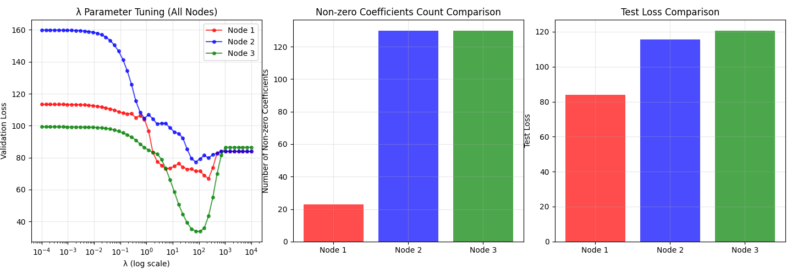
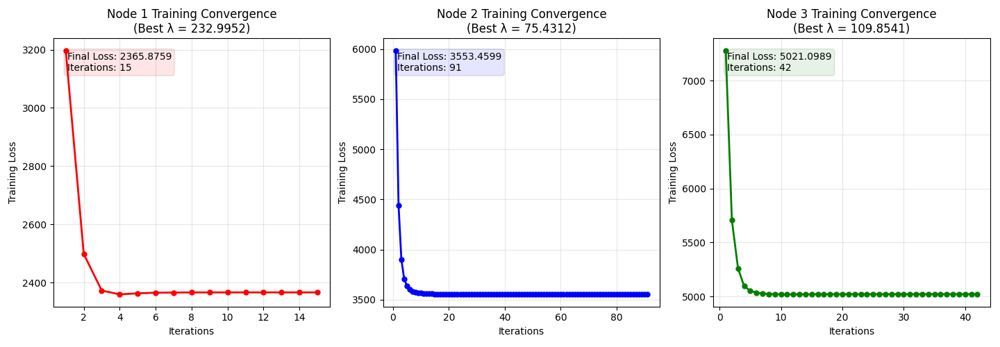
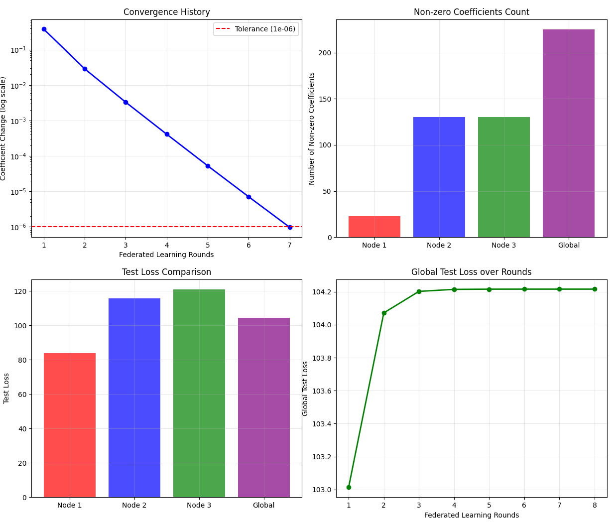
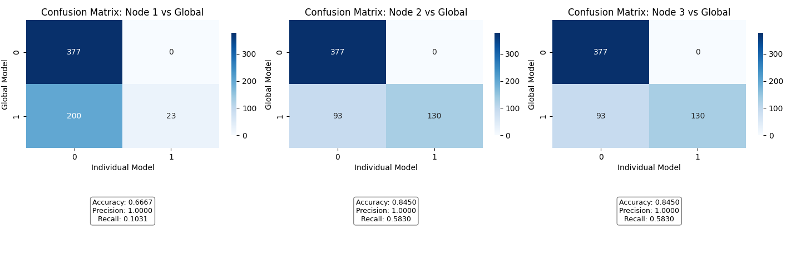

# 从零实现联邦套索回归 (Federated Lasso Regression)

[English Version README(英文版)](README.md)

## 1. 项目简介

本项目从零开始，使用 Python 完整地实现了基于坐标下降算法的Lasso回归。在此基础上，项目进一步将该实现扩展到一个联邦学习 (Federated Learning, FL) 环境中，模拟了多个数据所有者在不共享各自私有数据的前提下，协同训练一个统一且强大的机器学习模型的场景。

* **Part A: 独立模型训练:** 实现Lasso回归算法，为三个独立的数据集分别进行正则化超参数 $\lambda$ 的调优，并对最终模型进行深入分析。
* **Part B: 联邦学习:** 构建一个联邦系统，由一个中心的“可信聚合器”协调各个数据节点的模型训练过程。这展示了一种在实践中保护数据隐私的机器学习方法。

这个代码仓库旨在成为一个专业的项目展示，全面体现作者在算法实现、实验设计以及对现代机器学习范式分析等方面的能力。

### 主要功能

* **从零实现Lasso:** 包含了软阈值函数等核心部分的、代码清晰的Lasso坐标下降算法。
* **联邦学习框架:** 一个稳健的模拟框架，包含一个`TrustedAggregator`（可信聚合器）和多个数据节点。
* **超参数调优:** 基于验证集的方法，为模型寻找最优的正则化参数 $\lambda$。
* **详尽的分析:** 对独立模型与全局联邦模型的性能进行了深度比较。
* **性能评估:** 分析了在联邦学习设定中，通信频率（即本地迭代次数）如何影响模型的收敛速度和最终性能。

## 2. 方法

### A. 坐标下降法求解Lasso

Lasso回归通过在损失函数中加入L1惩罚项，来促使模型的系数向量变得稀疏。其目标函数为：

$$ \text{Loss} = \frac{1}{2n} \sum_{i=1}^{n} (y_i - (\beta_0 + \sum_{j=1}^{p} x_{ij}\beta_j))^2 + \lambda \sum_{j=1}^{p} |\beta_j| $$

由于L1范数在零点不可导，传统的梯度下降法难以直接应用。因此，我们采用**坐标下降法**。该算法每次只针对一个系数进行优化，同时固定其他所有系数。第 j 个系数 $\beta_j$ 的更新通过一个**软阈值**算子完成：

$$ \beta_j \leftarrow S(z_j, \lambda) = \text{sign}(z_j) \max(|z_j| - \lambda, 0) $$

其中 $z_j = \frac{1}{n} \sum_{i=1}^{n} x_{ij}(y_i - \sum_{k \neq j} x_{ik}\beta_k)$。

### B. 联邦平均算法

为了在不共享数据的情况下协同训练模型，我们采用了基于联邦平均（Federated Averaging, FedAvg）算法的联邦学习方法：

1.  **初始化:** 可信聚合器初始化一个全局模型（系数为零向量），并将其分发给所有数据所有者。
2.  **本地训练:** 每个数据所有者使用自己预先调优好的 $\lambda_k$，在本地数据上对接收到的模型进行固定次数（例如5次或10次）的迭代训练。
3.  **上传模型:** 每个所有者将更新后的模型系数发送回聚合器。
4.  **全局模型更新:** 聚合器根据各个数据所有者的样本量大小，对收集到的系数进行加权平均。
5.  **循环迭代:** 重复以上过程，直到全局模型的系数收敛（两次更新之间的变化小于预设的容忍度 $10^{-6}$）。

## 3. 结果与分析

### Part A: 独立节点模型

每个数据集被划分为80%的训练集和20%的验证集。最优的正则化参数 $\lambda$ 基于最低的验证集损失来选择。

| 节点 | 最优 $\lambda$ | 验证集损失 | 测试集损失 | 非零系数数量 |
|:----:|:--------------:|:----------:|:----------:|:------------:|
| 1    | 232.995        | 66.89      | 83.92      | 23           |
| 2    | 75.431         | 77.29      | 115.74     | 130          |
| 3    | 109.854        | 33.81      | 120.75     | 130          |

**非零系数的交集:** 在三个独立训练的模型中，共有 **13** 个共同的非零系数，其索引为: `[123, 249, 299, 305, 362, 399, 447, 461, 493, 500, 526, 559, 587]`。

_图 1: (左) 验证集损失随 $\lambda$ 的变化。 (中) 各模型非零系数的数量。 (右) 各节点最优模型的最终测试集损失。_

_图 2: 各节点最终模型的训练损失收敛过程。_

### Part B: 联邦学习模型

#### 场景一: 每 5 次本地迭代进行一次聚合

* **收敛情况:** 全局模型在 **8** 轮后收敛。
* **最终测试损失:** **104.22**
* **非零系数数量:** **225**

_图 3: 5次本地迭代场景下的收敛历史、非零系数数量和测试损失对比。_

_图 4: 对比最终全局模型与各独立模型稀疏性（零vs非零）的混淆矩阵。全局模型被视为“真实标签”。高召回率（Recall）表明全局模型成功地捕捉了几乎所有被独立模型认为重要的特征。_

#### 场景二: 每 10 次本地迭代进行一次聚合

* **收敛情况:** 全局模型收敛更快，仅用 **6** 轮。
* **最终测试损失:** **104.18** (略有提升)
* **非零系数数量:** **223**

_图 5: 10次本地迭代场景下的收敛历史、非零系数数量和测试损失对比。_

_图 6: 10次本地迭代场景下的混淆矩阵。与5次迭代的情况相比，节点2和节点3的准确率（Accuracy）有轻微提升。_

### 结论

* 联邦模型成功地学习到了一个共享的特征集，其测试损失在各个独立模型之间取得了合理的平衡。
* 将本地迭代次数从5次增加到10次，可以加快全局模型的收敛速度（减少通信轮次），并略微降低测试损失。这凸显了联邦系统中本地计算与通信开销之间的权衡。
* 全局模型识别出了比最受限的独立模型（节点1，仅23个）多得多的非零特征（超过220个），有效地聚合了来自所有数据源的知识。

